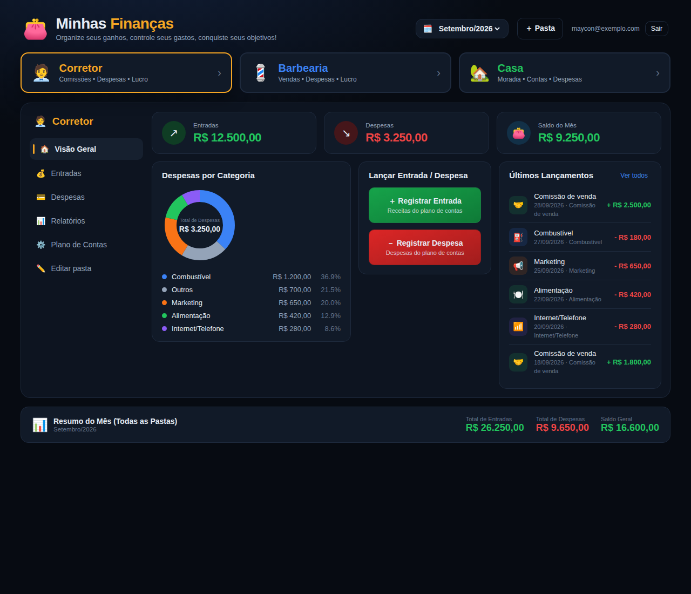
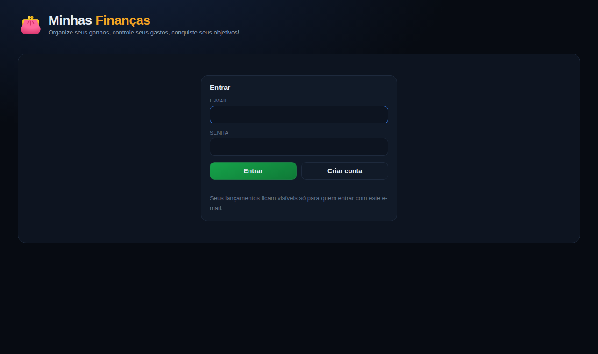
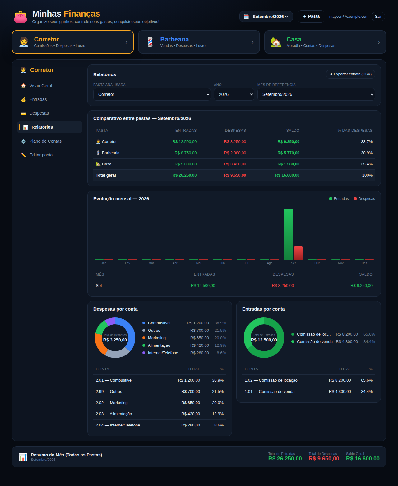
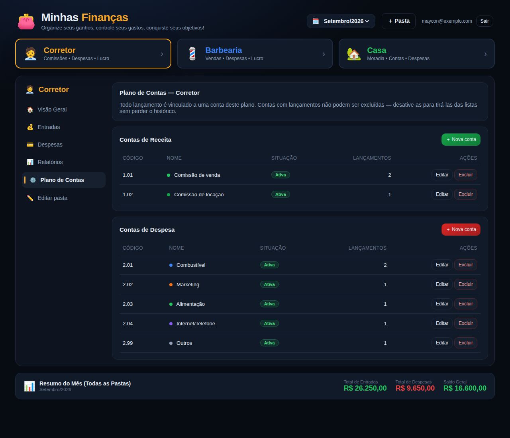

# 💰 Minhas Finanças — Controla Gastos

Controle de receitas e despesas separado por **Corretor**, **Barbearia** e **Casa**, com
plano de contas e relatórios.

Arquitetura: a **Vercel** serve só o front-end (uma página estática) e o **Supabase** é o
backend — banco PostgreSQL, API e login. Não existe servidor próprio no meio.



## O que o app faz

| Funcionalidade | Onde fica |
| --- | --- |
| **Lançar receita e despesa** | Botões *Registrar Entrada* / *Registrar Despesa* na Visão Geral, ou *Novo lançamento* nas abas Entradas e Despesas. Editar e excluir também. |
| **Plano de contas** (cadastrar, alterar e excluir) | Aba **Plano de Contas**. Toda receita/despesa é obrigatoriamente vinculada a uma conta. |
| **3 centros separados: Corretor, Casa e Barbearia** | As três "pastas" no topo. Cada uma tem seu próprio plano de contas, seus lançamentos e seus totais. Dá para criar outras pastas. |
| **Relatórios** | Aba **Relatórios**: comparativo entre as pastas, evolução mês a mês, receitas e despesas por conta, e exportação em CSV (abre no Excel). |
| **Login** | Cada pessoa vê apenas os próprios lançamentos. |

---

## Como colocar no ar

### Passo 1 — criar as tabelas no Supabase

1. No painel do Supabase, abra o **SQL Editor**.
2. Cole o conteúdo de [`supabase/schema.sql`](supabase/schema.sql) e execute.

Isso cria as três tabelas, as regras de negócio e a segurança. Pode ser executado de novo
sem problema — o arquivo é idempotente.

### Passo 2 — ligar o app ao seu projeto

1. No Supabase: **Project Settings → Data API**. Copie o **Project URL** e a chave
   **anon public**.
2. No projeto, edite `public/config.js` e cole os dois valores.

```js
export const SUPABASE_URL = "https://xxxxxxxx.supabase.co";
export const SUPABASE_ANON_KEY = "eyJhbGciOi...";
```

> A chave **anon** é feita para ficar visível no navegador — quem protege os dados é o
> login e o RLS. **Nunca** coloque aí a chave `service_role`: ela ignora o RLS.

### Passo 3 — publicar na Vercel

1. Em <https://vercel.com/new>, importe este repositório.
2. Não é preciso configurar nada: o `vercel.json` já aponta para a pasta `public/`.
3. **Deploy**.

### Passo 4 — criar sua conta

Abra o site, informe e-mail e senha e clique em **Criar conta**. As três pastas e o plano
de contas inicial são criados automaticamente no primeiro acesso.



> Dependendo da configuração do seu projeto, o Supabase pede confirmação por e-mail antes
> do primeiro acesso. Para desligar isso: **Authentication → Sign In / Providers → Email**,
> e desmarque *Confirm email*.

### Opcional — lançamentos de exemplo

Para ver as telas preenchidas, execute [`supabase/exemplo.sql`](supabase/exemplo.sql) no
SQL Editor depois de criar sua conta. Para remover depois:

```sql
delete from public.lancamentos where observacao = 'exemplo';
```

---

## Onde ficam as regras (e por que ali)

Nesta arquitetura o navegador fala **direto** com o banco. Tudo o que está no JavaScript
pode ser contornado por quem abrir as ferramentas de desenvolvedor. Por isso as regras
ficam no PostgreSQL, em `supabase/schema.sql`:

| Regra | Como é garantida |
| --- | --- |
| Cada pessoa só vê os próprios dados | RLS: `user_id = auth.uid()` nas três tabelas |
| Visitante sem login não acessa nada | Permissões revogadas do papel `anon` |
| O tipo e a pasta do lançamento vêm da conta | Gatilho `lancamento_derivar_da_conta` |
| Conta inativa não aceita lançamento | O mesmo gatilho |
| Conta com lançamentos não pode ser excluída | Chave estrangeira `on delete restrict` |
| Pasta com lançamentos não pode ser excluída | Chave estrangeira `on delete restrict` |
| Conta com lançamentos não muda de tipo | Gatilho `conta_proteger_tipo` |
| Valor sempre maior que zero | `check (valor_centavos > 0)` |
| Cor sempre no formato `#RRGGBB` | `check (cor ~ '^#[0-9a-fA-F]{6}$')` |

Os valores são guardados em **centavos (inteiros)**, então não existe erro de
arredondamento nas somas.

## Estrutura do projeto

```
public/index.html     a página
public/app.js         interface: telas, modais, eventos
public/dados.js       conversa com o Supabase (login e CRUD)
public/calculos.js    somas, percentuais, filtros e CSV — funções puras
public/config.js      endereço e chave do seu projeto Supabase
public/vendor/        biblioteca do Supabase, embutida para não depender de CDN
supabase/schema.sql   tabelas, regras de negócio e segurança
supabase/exemplo.sql  lançamentos de exemplo (opcional)
scripts/servir.mjs    servidor estático para rodar na sua máquina
tests/                testes automatizados
```

## Rodando na sua máquina

```bash
npm install
npm run dev      # http://localhost:8000
```

Usa o mesmo Supabase configurado em `public/config.js` — não há banco local.

## Testes

```bash
npm test          # 40 testes
npm run typecheck
```

- **`tests/calculos.test.ts`** — as somas, percentuais, filtros e o CSV.
- **`tests/schema.test.ts`** — as regras e a segurança do banco, rodando contra um
  PostgreSQL de verdade, com um dublê do que o Supabase fornece pronto
  (`auth.uid`, `auth.users` e os papéis `anon`/`authenticated`). Inclui verificar que um
  usuário não lê, não grava e não apaga os dados de outro.

Os testes de schema precisam de um PostgreSQL. Por padrão usam
`postgres://postgres@127.0.0.1:5433/supa_teste`; para outro servidor, defina
`DATABASE_URL_TESTE`.

Há também um teste de interface no navegador (`tests/e2e/`), que sobe a página com um
dublê da camada de dados em memória e percorre login, lançamentos, plano de contas e
relatórios sem depender de rede.

## Telas

**Relatórios** — comparativo entre as pastas, evolução mensal e totais por conta:



**Plano de contas** — cadastrar, alterar e excluir as contas de cada pasta:


