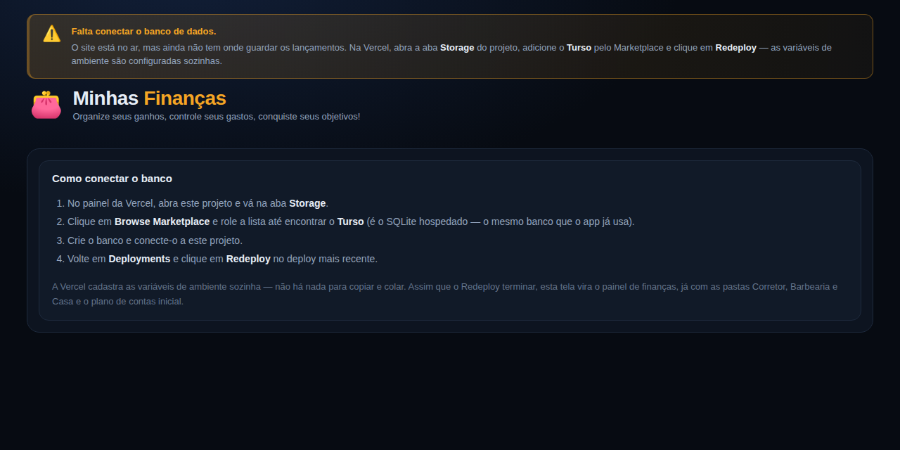

# 💰 Minhas Finanças — Controla Gastos

Controle de receitas e despesas separado por **Corretor**, **Barbearia** e **Casa**, com
plano de contas e relatórios. Feito em **TypeScript**, para rodar na **Vercel**, com banco
**SQLite** (via [Turso](https://turso.tech), que é SQLite hospedado).


## O que o app faz

| Funcionalidade | Onde fica |
| --- | --- |
| **Lançar receita e despesa** | Botões *Registrar Entrada* / *Registrar Despesa* na Visão Geral, ou *Novo lançamento* nas abas Entradas e Despesas. Editar e excluir também. |
| **Plano de contas** (cadastrar, alterar e excluir) | Aba **Plano de Contas**. Toda receita/despesa é obrigatoriamente vinculada a uma conta. |
| **3 centros separados: Corretor, Casa e Barbearia** | As três "pastas" no topo. Cada uma tem seu próprio plano de contas, seus lançamentos e seus totais. Dá para criar outras pastas. |
| **Relatórios** | Aba **Relatórios**: comparativo entre as pastas, evolução mês a mês, receitas e despesas por conta, e exportação em CSV (abre no Excel). |

---

## Como colocar na Vercel

A Vercel não guarda arquivos: o disco dela é apagado a todo momento, então o banco não
pode ser um arquivo dentro do projeto. Ele precisa ser um banco de dados de verdade — e
você adiciona um **sem sair do painel da Vercel**, pelo Marketplace dela.

### Passo 1 — subir o projeto

1. Em <https://vercel.com/new>, importe este repositório do GitHub.
2. Não é preciso mudar nada nas configurações de build — o `vercel.json` já está pronto.
3. Clique em **Deploy**.

Nesse momento o site já sobe, mas ainda sem banco: a tela mostra uma faixa laranja com o
passo a passo abaixo. É o passo 2 que resolve isso.

### Passo 2 — adicionar o banco pelo painel da Vercel

O Turso é o próprio SQLite hospedado, e está no Marketplace da Vercel. Isso significa que
você não precisa criar conta separada nem usar terminal:

1. No projeto, abra a aba **Storage**.
2. Clique em **Browse Marketplace** (ou *Create Database*). A lista abre mostrando
   *Global Config* e *Blob* no topo, e abaixo os *Marketplace Database Providers* —
   **role a lista até encontrar o Turso**, ele não fica entre os primeiros.
3. Crie o banco e conecte-o a este projeto.
4. Volte em **Deployments** e clique em **Redeploy** no deploy mais recente.

A Vercel provisiona a conta no Turso, conecta ao projeto e **cadastra sozinha** as
variáveis de ambiente `TURSO_DATABASE_URL` e `TURSO_AUTH_TOKEN` — é por isso que não há
nada para copiar e colar. O Redeploy é necessário porque variáveis novas só valem a
partir do próximo deploy.

Pronto. Na primeira vez que o site abrir, as tabelas e o plano de contas inicial são
criados sozinhos.

> **Se você procurar tutoriais antigos**, vai achar "Vercel KV" e "Vercel Postgres".
> Esses produtos foram descontinuados: hoje todo banco de dados na Vercel vem pelo
> Marketplace. Além do Turso, ele oferece Neon e Supabase (Postgres) e Upstash (Redis) —
> mas esses exigiriam reescrever o SQL do projeto, enquanto o Turso é o mesmo SQLite.

### Alternativa — criar o banco direto no Turso

Se preferir gerenciar o banco fora da Vercel (ou se quiser usar a camada gratuita do
Turso em vez do faturamento pela Vercel):

1. Crie a conta em <https://turso.tech>.
2. Instale a ferramenta de linha de comando e faça login:
   ```bash
   curl -sSfL https://get.tur.so/install.sh | bash
   turso auth login
   ```
3. Crie o banco e pegue os dois dados:
   ```bash
   turso db create controla-gastos
   turso db show controla-gastos --url        # copie: libsql://...
   turso db tokens create controla-gastos     # copie: o token
   ```
4. Na Vercel, em *Settings → Environment Variables*, cadastre `TURSO_DATABASE_URL` e
   `TURSO_AUTH_TOKEN` com esses valores, e clique em **Redeploy**.

### Se aparecer a faixa laranja de alerta



Significa que o app subiu **sem** o banco conectado. Ele não perde dados nesse estado —
simplesmente ainda não tem onde guardá-los, e mostra o passo a passo na própria tela.
Faça o passo 2 acima (aba **Storage** → Turso) e clique em **Redeploy**.

---

## Rodando na sua máquina (opcional)

Sem nenhuma variável de ambiente, o banco vira um arquivo local em `data/financas.db`:

```bash
npm install
npm run dev            # http://localhost:8000
npm run exemplo        # opcional: lançamentos de exemplo para ver as telas cheias
```

O servidor local usa exatamente o mesmo roteador que roda na Vercel, então o que funciona
aqui funciona lá.

## Estrutura do projeto

```
api/[...rota].ts   função da Vercel: responde por tudo em /api/
api/_rotas.ts      roteador: transforma Request em Response
api/_servico.ts    regras de negócio: validações, consultas e relatórios
api/_db.ts         conexão, criação das tabelas e dados iniciais
public/            interface: index.html, style.css, app.js
scripts/dev.ts     servidor local de desenvolvimento
scripts/exemplo.ts popula o banco com lançamentos de exemplo
tests/             testes automatizados (npm test)
vercel.json        rotas e configuração do deploy
```

Arquivos dentro de `api/` que começam com `_` não viram rotas na Vercel — são só código
de apoio.

## Banco de dados

Três tabelas, com integridade garantida por chaves estrangeiras:

- **pastas** — os centros de custo (Corretor, Barbearia, Casa e as que você criar).
- **contas** — o plano de contas. Cada conta tem código, nome, tipo (`receita`/`despesa`),
  cor, situação (ativa/inativa) e pertence a uma pasta (ou a todas).
- **lancamentos** — data, descrição, valor, observação, e os vínculos com a conta e a pasta.

Os valores são guardados em **centavos (inteiros)**, então não existe erro de
arredondamento de ponto flutuante nas somas.

### Regras de proteção
- Conta com lançamentos não pode ser excluída — desative-a para escondê-la dos
  formulários sem perder o histórico.
- Pasta com lançamentos não pode ser excluída.
- O tipo de uma conta não muda depois que ela já tem lançamentos.
- O tipo e a pasta do lançamento vêm da conta escolhida, o que impede classificar uma
  despesa como receita, ou lançar na pasta errada.

### Backup
```bash
turso db shell controla-gastos .dump > backup.sql
```

## Telas

**Relatórios** — comparativo entre as pastas, evolução mensal e totais por conta:


**Plano de contas** — cadastrar, alterar e excluir as contas de cada pasta:


## API HTTP

| Método | Rota | Descrição |
| --- | --- | --- |
| GET | `/api/status` | onde os dados estão sendo guardados |
| GET | `/api/painel?mes=AAAA-MM` | totais, categorias e últimos lançamentos de cada pasta |
| GET | `/api/meses` | meses e anos com movimento |
| GET/POST | `/api/pastas` | lista / cria pasta |
| PUT/DELETE | `/api/pastas/{id}` | altera / exclui pasta |
| GET/POST | `/api/contas` | lista / cria conta do plano de contas |
| PUT/DELETE | `/api/contas/{id}` | altera / exclui conta |
| GET/POST | `/api/lancamentos` | lista (com filtros) / cria lançamento |
| PUT/DELETE | `/api/lancamentos/{id}` | altera / exclui lançamento |
| GET | `/api/relatorios/categorias` | total por conta, com percentual |
| GET | `/api/relatorios/mensal?ano=` | evolução dos 12 meses |
| GET | `/api/relatorios/comparativo?mes=` | comparativo entre as pastas |
| GET | `/api/export.csv` | extrato em CSV |

Filtros aceitos nas listagens: `pasta`, `mes`, `tipo`, `conta`, `busca`, `de`, `ate`.

## Detalhe técnico: por que `@libsql/client/web`

O pacote `@libsql/client`, na entrada padrão, carrega um binário nativo (`libsql`) para
conseguir abrir arquivos `.db`. Esse binário não sobrevive ao empacotamento da função
serverless da Vercel — a função quebra ao carregar e responde uma página de erro em vez
de JSON.

Por isso o `api/_db.ts` escolhe a entrada conforme o destino: `@libsql/client/web` (só
HTTP, sem binário) quando o banco é o Turso, e `@libsql/client` quando é um arquivo local.
O import é dinâmico justamente para o binário nativo nunca ser carregado na Vercel.

## Testes

```bash
npm test          # 33 testes das regras de negócio, relatórios e armazenamento
npm run typecheck # verificação de tipos
```

## Aviso

O app não tem senha. Publicado na Vercel, o endereço fica acessível para quem tiver o
link. Se isso for um problema, vale proteger o projeto com o *Password Protection* da
Vercel (recurso pago) ou manter o uso apenas na sua máquina.
